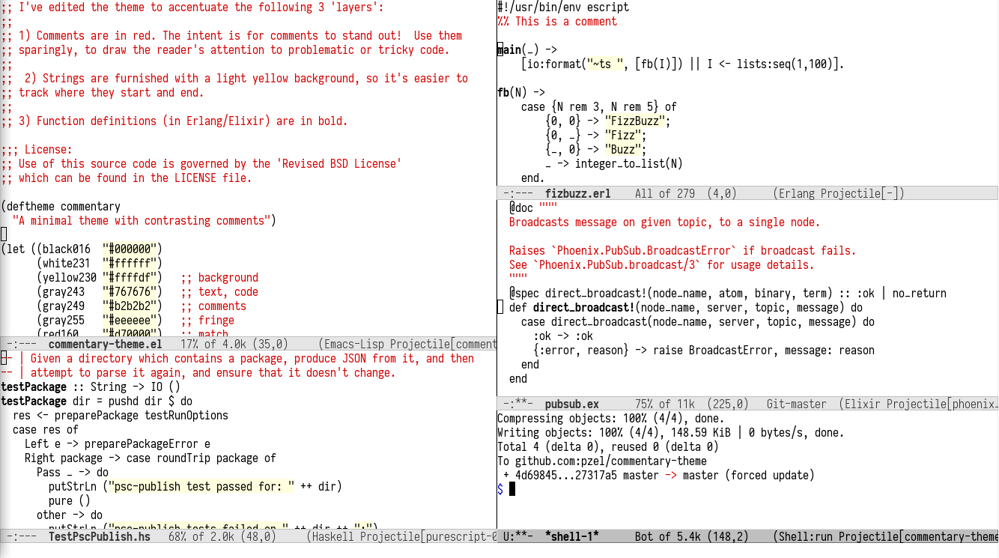

# commentary-theme
A minimalist, layered color theme for Emacs



## Installation

This theme is available [on MELPA](http://melpa.org/#/commentary-theme).

#### Interactive installation

In a running Emacs instance, type:

`M-x package-install`, hit `Enter`, then type `commentary-theme`, and hit
`Enter` again.

Then, run `M-x load-theme`, `Enter`, `commentary-theme`, and `Enter` again.


### Declarative installation

With [use-package](https://github.com/jwiegley/use-package), you can ensure the
theme is installed before using it:

```
;; ~/.emacs or ~/.emacs.d/init.el
(use-package commentary-theme
  :ensure t)

;; (...)

(load-theme 'commentary t)
```

